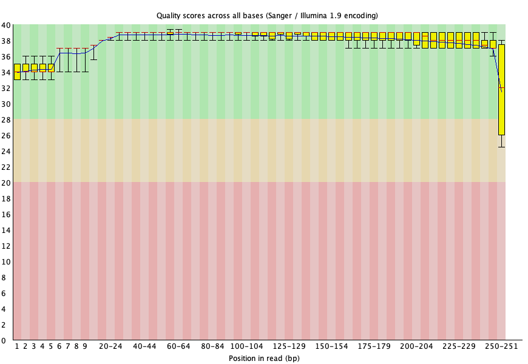
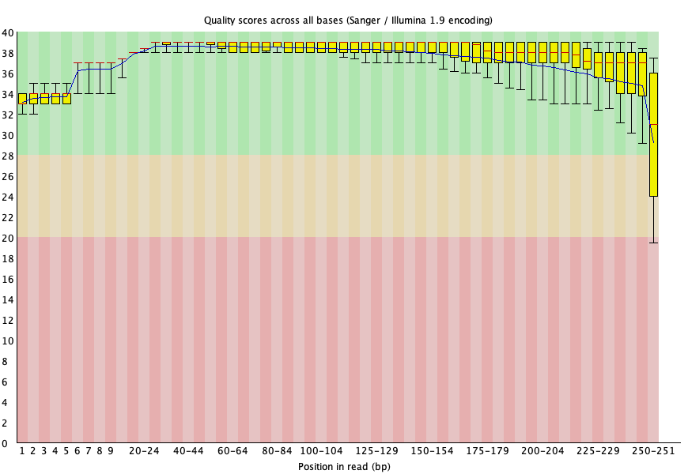
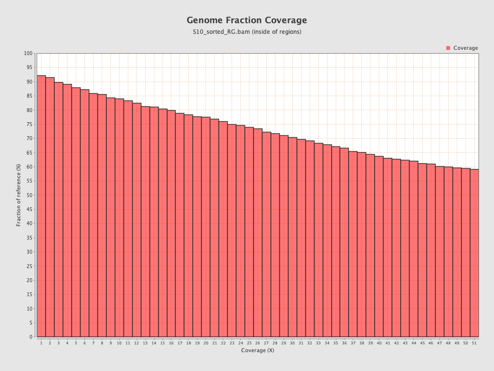

### Análisis de lecturas NGS
___

El siguiente trabajo corresponde al desarrollo de los [tutoriales de las sesiones 2 y 3 de la unidad 6 del curso de Introducción a la bioinformática e investigación reproducible para análisis genómicos](https://github.com/u-genoma/BioinfinvRepro/blob/master/Unidad6/Unidad6_IntroGenomica_NexGenSeq.md) realizado en colaboración entre la Universidad Nacional Autónoma de México, CONABIO y la Universidad de Chile, en el contexto de la tercera pasantía del curso de "Técnicas y Metodologías en Genética" de la escuela de postgrado de la Facultad de Medicina de la Universidad de Chile, bajo la guía del profesor Ricardo Verdugo.

#### Control de calidad

Si bien las muestras se reciben *post* control de  calidad inicial realizado y habiendo realizado la "poda" de los adaptadores y nucleótidos secuenciados con baja calidad, se realiza una "corroboración" utilizando fastqc con los siguientes comandos: 

```
$ fastqc ../181004_curso_calidad_datos_NGS/fastq_filter/S10_R1_filter.fastq.gz -o .
Started analysis of S10_R1_filter.fastq.gz
Approx 5% complete for S10_R1_filter.fastq.gz
Approx 10% complete for S10_R1_filter.fastq.gz
Approx 15% complete for S10_R1_filter.fastq.gz
Approx 20% complete for S10_R1_filter.fastq.gz
Approx 25% complete for S10_R1_filter.fastq.gz
Approx 30% complete for S10_R1_filter.fastq.gz
Approx 35% complete for S10_R1_filter.fastq.gz
Approx 40% complete for S10_R1_filter.fastq.gz
Approx 45% complete for S10_R1_filter.fastq.gz
Approx 50% complete for S10_R1_filter.fastq.gz
Approx 55% complete for S10_R1_filter.fastq.gz
Approx 60% complete for S10_R1_filter.fastq.gz
Approx 65% complete for S10_R1_filter.fastq.gz
Approx 70% complete for S10_R1_filter.fastq.gz
Approx 75% complete for S10_R1_filter.fastq.gz
Approx 80% complete for S10_R1_filter.fastq.gz
Approx 85% complete for S10_R1_filter.fastq.gz
Approx 90% complete for S10_R1_filter.fastq.gz
Approx 95% complete for S10_R1_filter.fastq.gz
Analysis complete for S10_R1_filter.fastq.gz

$ fastqc ../181004_curso_calidad_datos_NGS/fastq_filter/S10_R2_filter.fastq.gz -o .
Started analysis of S10_R2_filter.fastq.gz
Approx 5% complete for S10_R2_filter.fastq.gz
Approx 10% complete for S10_R2_filter.fastq.gz
Approx 15% complete for S10_R2_filter.fastq.gz
Approx 20% complete for S10_R2_filter.fastq.gz
Approx 25% complete for S10_R2_filter.fastq.gz
Approx 30% complete for S10_R2_filter.fastq.gz
Approx 35% complete for S10_R2_filter.fastq.gz
Approx 40% complete for S10_R2_filter.fastq.gz
Approx 45% complete for S10_R2_filter.fastq.gz
Approx 50% complete for S10_R2_filter.fastq.gz
Approx 55% complete for S10_R2_filter.fastq.gz
Approx 60% complete for S10_R2_filter.fastq.gz
Approx 65% complete for S10_R2_filter.fastq.gz
Approx 70% complete for S10_R2_filter.fastq.gz
Approx 75% complete for S10_R2_filter.fastq.gz
Approx 80% complete for S10_R2_filter.fastq.gz
Approx 85% complete for S10_R2_filter.fastq.gz
Approx 90% complete for S10_R2_filter.fastq.gz
Approx 95% complete for S10_R2_filter.fastq.gz
Analysis complete for S10_R2_filter.fastq.gz
```
 El argumento `-o` indica que el directorio a continuación es el lugar de destino de los archivos de output de fastqc, mientras que `.` indica que el directorio es el mismo que en el que estamos trabajando.
 
 Los resultados de fastqc para la muestra S10_R1 fue:
 
 
 
 Mostrando que practicamente todas las posiciones poseen un phred score mayor a 28 (a excepción de la última, pero aún así esta es >24), lo que indica lecturas de buena calidad.
 
 Por otro lado, los resultados para S10_R2 fueron:
 
  
  
  Que si bien podrían considerarse de una calidad ligeramente inferior al read 1, siguen siendo de buena calidad (phred score >30 en practicamente todas las lecturas).
  
  Adicionalmente, no se observa contenido de adaptadores en ninguno de los read (gráficos no mostrados).
  
### Alineamiento de lecturas

Las secuencias se alinean contra el genoma de referencia, en este caso el hg19, con el software bwa, obteniendo un archivo sam.

Para esto fue necesario descargar un genoma de referencia, en este caso fue el hg19. Para su descarga se utilizaron los siguientes comandos:

```
wget hgdownload.cse.ucsc.edu/goldenPath/hg19/bigZips/chromFa.tar.gz
tar -zxvf chromFa.tar.gz
cat chr*.fa > hg19.fa
```
Posteriormente, fue necesario "procesar" este genoma de referencia de modo de que fuera compatible con el software bwa. Para eso se utilizaron los siguientes comandos:

```
bwa index -a bwtsw hg19.fasta
```
```
samtools faidx hg19.fasta
```
```
java -jar picard.jar CreateSequenceDictionary REFERENCE=hg19.fasta OUTPUT=hg19.dict
```
Este procesamiento generó diversos archivos derivados de "hg19_reference.fa".

```
$ ls hg19*
hg19.dict      hg19.fasta.ann hg19.fasta.sa
hg19.fasta     hg19.fasta.bwt
hg19.fasta.amb hg19.fasta.pac
```

Una vez completados estos pasos se procede al alineamiento mediante el software bwa:


```
$ bwa mem -t 4 -M /home-old/data/references/genomes/hg19_reference/hg19.fasta ../181004_curso_calidad_datos_NGS/fastq_filter/S10_R1_filter.fastq.gz ../181004_curso_calidad_datos_NGS/fastq_filter/S10_R2_filter.fastq.gz > S10.sam
[M::bwa_idx_load_from_disk] read 0 ALT contigs
[M::process] read 62070 sequences (13815518 bp)...
[M::mem_pestat] # candidate unique pairs for (FF, FR, RF, RR): (0, 30320, 0, 0)
[M::mem_pestat] skip orientation FF as there are not enough pairs
[M::mem_pestat] analyzing insert size distribution for orientation FR...
[M::mem_pestat] (25, 50, 75) percentile: (230, 246, 265)
[M::mem_pestat] low and high boundaries for computing mean and std.dev: (160, 335)
[M::mem_pestat] mean and std.dev: (247.13, 17.36)
[M::mem_pestat] low and high boundaries for proper pairs: (125, 370)
[M::mem_pestat] skip orientation RF as there are not enough pairs
[M::mem_pestat] skip orientation RR as there are not enough pairs
[M::mem_process_seqs] Processed 62070 reads in 29.060 CPU sec, 7.360 real sec
[main] Version: 0.7.17-r1188
[main] CMD: /opt/bwa-0.7.17/bwa mem -t 4 -M /home-old/data/references/genomes/hg19_reference/hg19.fasta ../181004_curso_calidad_datos_NGS/fastq_filter/S10_R1_filter.fastq.gz ../181004_curso_calidad_datos_NGS/fastq_filter/S10_R2_filter.fastq.gz
[main] Real time: 38.306 sec; CPU: 59.536 sec
```
Luego el archivo es convertido de formato bam a sam para que sea compatible con el software GATK.

```
$ java -jar /opt/picard-tools-2.5.0/picard.jar SamFormatConverter I=S10.sam O=S10.bam
[Mon Jul 18 21:33:40 CLT 2022] picard.sam.SamFormatConverter INPUT=S10.sam OUTPUT=S10.bam    VERBOSITY=INFO QUIET=false VALIDATION_STRINGENCY=STRICT COMPRESSION_LEVEL=5 MAX_RECORDS_IN_RAM=500000 CREATE_INDEX=false CREATE_MD5_FILE=false GA4GH_CLIENT_SECRETS=client_secrets.json
[Mon Jul 18 21:33:44 CLT 2022] picard.sam.SamFormatConverter done. Elapsed time: 0.07 minutes.
Runtime.totalMemory()=637009920
```
Luego, es necesario que las lecturas en el archivo bam sean ordenadas por posición de acuerdo con el genoma de referencia:

```
$ java -jar /opt/picard-tools-2.5.0/picard.jar SortSam I=S10.bam O=S10_sorted.bam SO=coordinate
[Mon Jul 18 21:33:57 CLT 2022] picard.sam.SortSam INPUT=S10.bam OUTPUT=S10_sorted.bam SORT_ORDER=coordinate    VERBOSITY=INFO QUIET=false VALIDATION_STRINGENCY=STRICT COMPRESSION_LEVEL=5 MAX_RECORDS_IN_RAM=500000 CREATE_INDEX=false CREATE_MD5_FILE=false GA4GH_CLIENT_SECRETS=client_secrets.json
INFO	2022-07-18 21:33:58	SortSam	Finished reading inputs, merging and writing to output now.
[Mon Jul 18 21:34:00 CLT 2022] picard.sam.SortSam done. Elapsed time: 0.06 minutes.
Runtime.totalMemory()=504889344
``` 
Agregar columna readgroups

```
$ java -jar /opt/picard-tools-2.5.0/picard.jar AddOrReplaceReadGroups I=S10_sorted.bam O=S10_sorted_RG.bam ID=sample LB=Paired-end PL=Illumina PU=Unknown SM=sample
[Mon Jul 18 21:34:24 CLT 2022] picard.sam.AddOrReplaceReadGroups INPUT=S10_sorted.bam OUTPUT=S10_sorted_RG.bam RGID=sample RGLB=Paired-end RGPL=Illumina RGPU=Unknown RGSM=sample    VERBOSITY=INFO QUIET=false VALIDATION_STRINGENCY=STRICT COMPRESSION_LEVEL=5 MAX_RECORDS_IN_RAM=500000 CREATE_INDEX=false CREATE_MD5_FILE=false GA4GH_CLIENT_SECRETS=client_secrets.json
INFO	2022-07-18 21:34:24	AddOrReplaceReadGroups	Created read group ID=sample PL=Illumina LB=Paired-end SM=sample

[Mon Jul 18 21:34:26 CLT 2022] picard.sam.AddOrReplaceReadGroups done. Elapsed time: 0.05 minutes.
Runtime.totalMemory()=504889344
```

Posteriormente, es posible realizar un análisis de calidad mediante el software Qualimap, mediante el siguiente comando:

```
$ /opt/qualimap_v2.2.1_2/qualimap bamqc -bam S10_sorted_RG.bam -gff ../181004_curso_calidad_datos_NGS/regiones_blanco.bed -outdir ./S10_sorted_RG
Java memory size is set to 5000M
Launching application...

OpenJDK 64-Bit Server VM warning: ignoring option MaxPermSize=1024m; support was removed in 8.0
QualiMap v.2.2.1
Built on 2016-10-03 18:14

Selected tool: bamqc
Available memory (Mb): 32
Max memory (Mb): 4660
Starting bam qc....
Loading sam header...
Loading locator...
Loading reference...
Number of windows: 400, effective number of windows: 424
Chunk of reads size: 1000
Number of threads: 48
Initializing regions from ../181004_curso_calidad_datos_NGS/regiones_blanco.bed.....
Found 369 regions
Filling region references... 
Processed 50 out of 424 windows...
Processed 100 out of 424 windows...
Processed 150 out of 424 windows...
Processed 200 out of 424 windows...
Processed 250 out of 424 windows...
Processed 300 out of 424 windows...
Processed 350 out of 424 windows...
Processed 400 out of 424 windows...
Total processed windows:424
Number of reads: 62077
Number of valid reads: 62031
Number of correct strand reads:0

Inside of regions...
Num mapped reads: 60258
Num mapped first of pair: 30248
Num mapped second of pair: 30010
Num singletons: 44
Time taken to analyze reads: 54
Computing descriptors...
numberOfMappedBases: 8903968
referenceSize: 3095693983
numberOfSequencedBases: 8899841
numberOfAs: 2379499
Computing per chromosome statistics...
Computing histograms...
Overall analysis time: 54
end of bam qc
Computing report...
Writing HTML report...
HTML report created successfully

Finished

$ ls
S10.bam                   S10_R2_filter_fastqc.html hg19_reference.fa.ann
S10.sam                   S10_R2_filter_fastqc.zip  hg19_reference.fa.bwt
S10_R1.png                S10_sorted.bam            hg19_reference.fa.pac
S10_R1_filter.fastq.gz    S10_sorted_RG             hg19_reference.fa.sa
S10_R1_filter_fastqc.html S10_sorted_RG.bam         picard.jar
S10_R1_filter_fastqc.zip  S10_sorted_RG.bam.bai     qualimap
S10_R2.png                hg19_reference.fa         qualimap_v2.2.1
S10_R2_filter.fastq.gz    hg19_reference.fa.amb     regiones_blanco.bed
```

El archivo "regiones_blanco.bed" corresponde a un archivo que indica cuales fueron las regiones blanco de secuenciación (panel dirigido).

El análisis con Qualimap muestra que la profundidad de cobertura de la corrida fue de 97,7169 (alineamientos "uno sobre otro"). 

Por otro lado, la amplitud de la cobertura para las distintas regiones fue como se indica en el gráfico a continuación:

 
 
#### Tarea

**Generar un reporte técnico de calidad del alineamiento con qualimap.**

[Reporte Qualimap](Images/Qualimap_report_ BAMQC.pdf)
 
 
### Procesamiento del alineamiento usando GATK

Lo primero es calibrar la puntuación de calidad de las bases utilizando la herramienta "BaseRecalibrator" del software gatk. Para eso utilizamos el siguiente comando:

```
$ ava -jar /opt/GenomeAnalysisTK-3.7-0/GenomeAnalysisTK.jar -T BaseRecalibrator -R /home-old/data/references/genomes/hg19_reference/hg19.fasta -I S10_sorted_RG.bam -knownSites /home-old/data/references/genomes/hg19_reference/dbSNP_hg19.vcf -o S10_recall_data.table
INFO  21:35:59,004 HelpFormatter - --------------------------------------------------------------------------------- 
INFO  21:35:59,008 HelpFormatter - The Genome Analysis Toolkit (GATK) v3.7-0-gcfedb67, Compiled 2016/12/12 11:21:18 
INFO  21:35:59,009 HelpFormatter - Copyright (c) 2010-2016 The Broad Institute 
INFO  21:35:59,009 HelpFormatter - For support and documentation go to https://software.broadinstitute.org/gatk 
INFO  21:35:59,009 HelpFormatter - [Mon Jul 18 21:35:58 CLT 2022] Executing on Linux 2.6.32-754.2.1.el6.x86_64 amd64 
INFO  21:35:59,011 HelpFormatter - OpenJDK 64-Bit Server VM 1.8.0_152-release-1056-b12 
INFO  21:35:59,017 HelpFormatter - Program Args: -T BaseRecalibrator -R /home-old/data/references/genomes/hg19_reference/hg19.fasta -I S10_sorted_RG.bam -knownSites /home-old/data/references/genomes/hg19_reference/dbSNP_hg19.vcf -o S10_recall_data.table 
INFO  21:35:59,025 HelpFormatter -  
INFO  21:35:59,026 HelpFormatter - Date/Time: 2022/07/18 21:35:59 
INFO  21:35:59,027 HelpFormatter - --------------------------------------------------------------------------------- 
INFO  21:35:59,027 HelpFormatter - --------------------------------------------------------------------------------- 
INFO  21:35:59,080 GenomeAnalysisEngine - Strictness is SILENT 
INFO  21:35:59,373 GenomeAnalysisEngine - Downsampling Settings: No downsampling 
INFO  21:35:59,383 SAMDataSource$SAMReaders - Initializing SAMRecords in serial 
INFO  21:35:59,430 SAMDataSource$SAMReaders - Done initializing BAM readers: total time 0.03 
INFO  21:36:00,128 GenomeAnalysisEngine - Preparing for traversal over 1 BAM files 
INFO  21:36:00,137 GenomeAnalysisEngine - Done preparing for traversal 
INFO  21:36:00,138 ProgressMeter - [INITIALIZATION COMPLETE; STARTING PROCESSING] 
INFO  21:36:00,138 ProgressMeter -                 | processed |    time |    per 1M |           |   total | remaining 
INFO  21:36:00,139 ProgressMeter -        Location |     reads | elapsed |     reads | completed | runtime |   runtime 
INFO  21:36:00,203 BaseRecalibrator - The covariates being used here:  
INFO  21:36:00,204 BaseRecalibrator - 	ReadGroupCovariate 
INFO  21:36:00,204 BaseRecalibrator - 	QualityScoreCovariate 
INFO  21:36:00,204 BaseRecalibrator - 	ContextCovariate 
INFO  21:36:00,204 ContextCovariate - 		Context sizes: base substitution model 2, indel substitution model 3 
INFO  21:36:00,205 BaseRecalibrator - 	CycleCovariate 
INFO  21:36:00,208 ReadShardBalancer$1 - Loading BAM index data 
INFO  21:36:00,209 ReadShardBalancer$1 - Done loading BAM index data 
INFO  21:36:30,145 ProgressMeter -   chr1:43818497         0.0    30.0 s      49.6 w        1.4%    35.3 m      34.8 m 
INFO  21:37:00,148 ProgressMeter -   chr7:50358848     13760.0    60.0 s      72.7 m       41.5%     2.4 m      84.0 s 
INFO  21:37:30,152 ProgressMeter -  chr10:89720947     23662.0    90.0 s      63.4 m       57.2%     2.6 m      67.0 s 
INFO  21:38:00,154 ProgressMeter -  chr16:84534740     48244.0   120.0 s      41.5 m       80.6%     2.5 m      28.0 s 
INFO  21:38:13,804 BaseRecalibrator - Calculating quantized quality scores... 
INFO  21:38:13,859 BaseRecalibrator - Writing recalibration report... 
INFO  21:38:16,211 BaseRecalibrator - ...done! 
INFO  21:38:16,212 BaseRecalibrator - BaseRecalibrator was able to recalibrate 60864 reads 
INFO  21:38:16,214 ProgressMeter -            done     60864.0     2.3 m      37.3 m       87.0%     2.6 m      20.0 s 
INFO  21:38:16,214 ProgressMeter - Total runtime 136.08 secs, 2.27 min, 0.04 hours 
INFO  21:38:16,215 MicroScheduler - 1213 reads were filtered out during the traversal out of approximately 62077 total reads (1.95%) 
INFO  21:38:16,216 MicroScheduler -   -> 0 reads (0.00% of total) failing BadCigarFilter 
INFO  21:38:16,216 MicroScheduler -   -> 0 reads (0.00% of total) failing DuplicateReadFilter 
INFO  21:38:16,216 MicroScheduler -   -> 0 reads (0.00% of total) failing FailsVendorQualityCheckFilter 
INFO  21:38:16,216 MicroScheduler -   -> 0 reads (0.00% of total) failing MalformedReadFilter 
INFO  21:38:16,217 MicroScheduler -   -> 0 reads (0.00% of total) failing MappingQualityUnavailableFilter 
INFO  21:38:16,217 MicroScheduler -   -> 1209 reads (1.95% of total) failing MappingQualityZeroFilter 
INFO  21:38:16,217 MicroScheduler -   -> 4 reads (0.01% of total) failing NotPrimaryAlignmentFilter 
INFO  21:38:16,218 MicroScheduler -   -> 0 reads (0.00% of total) failing UnmappedReadFilter 
------------------------------------------------------------------------------------------
Done. There were no warn messages.
------------------------------------------------------------------------------------------
```
Lo que genera el archivo `S10_recall_data.table`. 

Luego se aplicó la recalibración mediante la herramienta ApplyBQSR:

```
$ gatk-4.2.6.0/gatk ApplyBQSR -R hg19_reference.fa -I S10_sorted_RG.bam -bqsr-recal-file S10_recall_data.table -O S10_recall_reads.bam
Using GATK jar /Users/camilo/Desktop/Pasantia_profesor_Verdugo/analisis_secuencias/gatk-4.2.6.0/gatk-package-4.2.6.0-local.jar
Running:
    java -Dsamjdk.use_async_io_read_samtools=false -Dsamjdk.use_async_io_write_samtools=true -Dsamjdk.use_async_io_write_tribble=false -Dsamjdk.compression_level=2 -jar /Users/camilo/Desktop/Pasantia_profesor_Verdugo/analisis_secuencias/gatk-4.2.6.0/gatk-package-4.2.6.0-local.jar ApplyBQSR -R hg19_reference.fa -I S10_sorted_RG.bam -bqsr-recal-file S10_recall_data.table -O S10_recall_reads.bam
20:51:02.026 INFO  NativeLibraryLoader - Loading libgkl_compression.dylib from jar:file:/Users/camilo/Desktop/Pasantia_profesor_Verdugo/analisis_secuencias/gatk-4.2.6.0/gatk-package-4.2.6.0-local.jar!/com/intel/gkl/native/libgkl_compression.dylib
20:51:02.611 INFO  ApplyBQSR - ------------------------------------------------------------
20:51:02.611 INFO  ApplyBQSR - The Genome Analysis Toolkit (GATK) v4.2.6.0
20:51:02.611 INFO  ApplyBQSR - For support and documentation go to https://software.broadinstitute.org/gatk/
20:51:02.611 INFO  ApplyBQSR - Executing as camilo@MacBook-Pro-de-Camilo.local on Mac OS X v12.4 x86_64
20:51:02.611 INFO  ApplyBQSR - Java runtime: OpenJDK 64-Bit Server VM v11.0.15+10-LTS
20:51:02.612 INFO  ApplyBQSR - Start Date/Time: 14 de julio de 2022, 20:51:01 CLT
20:51:02.612 INFO  ApplyBQSR - ------------------------------------------------------------
20:51:02.612 INFO  ApplyBQSR - ------------------------------------------------------------
20:51:02.614 INFO  ApplyBQSR - HTSJDK Version: 2.24.1
20:51:02.614 INFO  ApplyBQSR - Picard Version: 2.27.1
20:51:02.614 INFO  ApplyBQSR - Built for Spark Version: 2.4.5
20:51:02.614 INFO  ApplyBQSR - HTSJDK Defaults.COMPRESSION_LEVEL : 2
20:51:02.614 INFO  ApplyBQSR - HTSJDK Defaults.USE_ASYNC_IO_READ_FOR_SAMTOOLS : false
20:51:02.614 INFO  ApplyBQSR - HTSJDK Defaults.USE_ASYNC_IO_WRITE_FOR_SAMTOOLS : true
20:51:02.614 INFO  ApplyBQSR - HTSJDK Defaults.USE_ASYNC_IO_WRITE_FOR_TRIBBLE : false
20:51:02.614 INFO  ApplyBQSR - Deflater: IntelDeflater
20:51:02.614 INFO  ApplyBQSR - Inflater: IntelInflater
20:51:02.614 INFO  ApplyBQSR - GCS max retries/reopens: 20
20:51:02.614 INFO  ApplyBQSR - Requester pays: disabled
20:51:02.615 INFO  ApplyBQSR - Initializing engine
20:51:02.777 INFO  ApplyBQSR - Done initializing engine
20:51:02.802 INFO  ProgressMeter - Starting traversal
20:51:02.803 INFO  ProgressMeter -        Current Locus  Elapsed Minutes       Reads Processed     Reads/Minute
20:51:05.190 WARN  IntelInflater - Zero Bytes Written : 0
20:51:05.199 INFO  ApplyBQSR - 0 read(s) filtered by: WellformedReadFilter 

20:51:05.205 INFO  ProgressMeter -         chrY:1535179              0.0                 62077        1554515.9
20:51:05.207 INFO  ProgressMeter - Traversal complete. Processed 62077 total reads in 0.0 minutes.
20:51:05.253 INFO  ApplyBQSR - Shutting down engine
[14 de julio de 2022, 20:51:05 CLT] org.broadinstitute.hellbender.tools.walkers.bqsr.ApplyBQSR done. Elapsed time: 0.05 minutes.
Runtime.totalMemory()=322961408
```

```
java -jar /opt/GenomeAnalysisTK-3.7-0/GenomeAnalysisTK.jar -T PrintReads -R  /home-old/data/references/genomes/hg19_reference/hg19.fasta -I S10_sorted_RG.bam --BQSR S10_recall_data.table -o S10_recall_reads.bam
INFO  21:38:29,595 HelpFormatter - --------------------------------------------------------------------------------- 
INFO  21:38:29,599 HelpFormatter - The Genome Analysis Toolkit (GATK) v3.7-0-gcfedb67, Compiled 2016/12/12 11:21:18 
INFO  21:38:29,599 HelpFormatter - Copyright (c) 2010-2016 The Broad Institute 
INFO  21:38:29,599 HelpFormatter - For support and documentation go to https://software.broadinstitute.org/gatk 
INFO  21:38:29,600 HelpFormatter - [Mon Jul 18 21:38:29 CLT 2022] Executing on Linux 2.6.32-754.2.1.el6.x86_64 amd64 
INFO  21:38:29,600 HelpFormatter - OpenJDK 64-Bit Server VM 1.8.0_152-release-1056-b12 
INFO  21:38:29,607 HelpFormatter - Program Args: -T PrintReads -R /home-old/data/references/genomes/hg19_reference/hg19.fasta -I S10_sorted_RG.bam --BQSR S10_recall_data.table -o S10_recall_reads.bam 
INFO  21:38:29,615 HelpFormatter -  
INFO  21:38:29,616 HelpFormatter - Date/Time: 2022/07/18 21:38:29 
INFO  21:38:29,616 HelpFormatter - --------------------------------------------------------------------------------- 
INFO  21:38:29,616 HelpFormatter - --------------------------------------------------------------------------------- 
INFO  21:38:29,810 GenomeAnalysisEngine - Strictness is SILENT 
INFO  21:38:30,905 ContextCovariate - 		Context sizes: base substitution model 2, indel substitution model 3 
INFO  21:38:30,967 GenomeAnalysisEngine - Downsampling Settings: No downsampling 
INFO  21:38:30,977 SAMDataSource$SAMReaders - Initializing SAMRecords in serial 
INFO  21:38:31,012 SAMDataSource$SAMReaders - Done initializing BAM readers: total time 0.03 
INFO  21:38:31,238 GenomeAnalysisEngine - Preparing for traversal over 1 BAM files 
INFO  21:38:31,245 GenomeAnalysisEngine - Done preparing for traversal 
INFO  21:38:31,246 ProgressMeter - [INITIALIZATION COMPLETE; STARTING PROCESSING] 
INFO  21:38:31,246 ProgressMeter -                 | processed |    time |    per 1M |           |   total | remaining 
INFO  21:38:31,247 ProgressMeter -        Location |     reads | elapsed |     reads | completed | runtime |   runtime 
INFO  21:38:31,258 ReadShardBalancer$1 - Loading BAM index data 
INFO  21:38:31,260 ReadShardBalancer$1 - Done loading BAM index data 
INFO  21:38:47,684 Walker - [REDUCE RESULT] Traversal result is: org.broadinstitute.gatk.engine.io.stubs.SAMFileWriterStub@16602333 
INFO  21:38:47,689 ProgressMeter -            done     62077.0    16.0 s       4.4 m       98.1%    16.0 s       0.0 s 
INFO  21:38:47,690 ProgressMeter - Total runtime 16.44 secs, 0.27 min, 0.00 hours 
INFO  21:38:47,690 MicroScheduler - 0 reads were filtered out during the traversal out of approximately 62077 total reads (0.00%) 
INFO  21:38:47,691 MicroScheduler -   -> 0 reads (0.00% of total) failing BadCigarFilter 
INFO  21:38:47,691 MicroScheduler -   -> 0 reads (0.00% of total) failing MalformedReadFilter 
------------------------------------------------------------------------------------------
Done. There were no warn messages.
------------------------------------------------------------------------------------------
```


Luego, el llamado de variantes:

```
$ java -jar /opt/GenomeAnalysisTK-3.7-0/GenomeAnalysisTK.jar -T HaplotypeCaller -R /home-old/data/references/genomes/hg19_reference/hg19.fasta -I S10_recall_reads.bam --dbsnp /home-old/data/references/genomes/hg19_reference/dbSNP_hg19.vcf -stand_call_conf 30 -L "chr19" -o S10_raw_variants.vcf
INFO  21:39:02,611 HelpFormatter - --------------------------------------------------------------------------------- 
INFO  21:39:02,616 HelpFormatter - The Genome Analysis Toolkit (GATK) v3.7-0-gcfedb67, Compiled 2016/12/12 11:21:18 
INFO  21:39:02,616 HelpFormatter - Copyright (c) 2010-2016 The Broad Institute 
INFO  21:39:02,616 HelpFormatter - For support and documentation go to https://software.broadinstitute.org/gatk 
INFO  21:39:02,617 HelpFormatter - [Mon Jul 18 21:39:02 CLT 2022] Executing on Linux 2.6.32-754.2.1.el6.x86_64 amd64 
INFO  21:39:02,617 HelpFormatter - OpenJDK 64-Bit Server VM 1.8.0_152-release-1056-b12 
INFO  21:39:02,624 HelpFormatter - Program Args: -T HaplotypeCaller -R /home-old/data/references/genomes/hg19_reference/hg19.fasta -I S10_recall_reads.bam --dbsnp /home-old/data/references/genomes/hg19_reference/dbSNP_hg19.vcf -stand_call_conf 30 -L chr19 -o S10_raw_variants.vcf 
INFO  21:39:02,631 HelpFormatter -  
INFO  21:39:02,632 HelpFormatter - Date/Time: 2022/07/18 21:39:02 
INFO  21:39:02,632 HelpFormatter - --------------------------------------------------------------------------------- 
INFO  21:39:02,632 HelpFormatter - --------------------------------------------------------------------------------- 
INFO  21:39:02,670 GenomeAnalysisEngine - Strictness is SILENT 
INFO  21:39:02,897 GenomeAnalysisEngine - Downsampling Settings: Method: BY_SAMPLE, Target Coverage: 500 
INFO  21:39:02,908 SAMDataSource$SAMReaders - Initializing SAMRecords in serial 
INFO  21:39:02,945 SAMDataSource$SAMReaders - Done initializing BAM readers: total time 0.03 
INFO  21:39:02,965 HCMappingQualityFilter - Filtering out reads with MAPQ < 20 
INFO  21:39:03,174 IntervalUtils - Processing 59128983 bp from intervals 
INFO  21:39:03,286 GenomeAnalysisEngine - Preparing for traversal over 1 BAM files 
INFO  21:39:03,412 GenomeAnalysisEngine - Done preparing for traversal 
INFO  21:39:03,412 ProgressMeter - [INITIALIZATION COMPLETE; STARTING PROCESSING] 
INFO  21:39:03,413 ProgressMeter -                 |      processed |    time |         per 1M |           |   total | remaining 
INFO  21:39:03,413 ProgressMeter -        Location | active regions | elapsed | active regions | completed | runtime |   runtime 
INFO  21:39:03,414 HaplotypeCaller - Disabling physical phasing, which is supported only for reference-model confidence output 
INFO  21:39:03,638 StrandBiasTest - SAM/BAM data was found. Attempting to use read data to calculate strand bias annotations values. 
WARN  21:39:03,639 InbreedingCoeff - Annotation will not be calculated. InbreedingCoeff requires at least 10 unrelated samples. 
INFO  21:39:03,640 StrandBiasTest - SAM/BAM data was found. Attempting to use read data to calculate strand bias annotations values. 
INFO  21:39:03,732 HaplotypeCaller - Using global mismapping rate of 45 => -4.5 in log10 likelihood units 
Using SSE4.1 accelerated implementation of PairHMM
INFO  21:39:23,892 VectorLoglessPairHMM - libVectorLoglessPairHMM unpacked successfully from GATK jar file 
INFO  21:39:23,893 VectorLoglessPairHMM - Using vectorized implementation of PairHMM 
WARN  21:39:24,904 HaplotypeScore - Annotation will not be calculated, must be called from UnifiedGenotyper, not org.broadinstitute.gatk.tools.walkers.haplotypecaller.HaplotypeCaller 
INFO  21:39:33,418 ProgressMeter -  chr19:17952972              0.0    30.0 s           49.6 w       30.4%    98.0 s      68.0 s 
INFO  21:40:03,420 ProgressMeter -  chr19:41202010              0.0    60.0 s           99.2 w       69.7%    86.0 s      26.0 s 
INFO  21:40:26,258 VectorLoglessPairHMM - Time spent in setup for JNI call : 0.006429898000000001 
INFO  21:40:26,258 PairHMM - Total compute time in PairHMM computeLikelihoods() : 1.301011063 
INFO  21:40:26,259 HaplotypeCaller - Ran local assembly on 9 active regions 
INFO  21:40:26,299 ProgressMeter -            done      5.9128983E7    82.0 s            1.0 s      100.0%    82.0 s       0.0 s 
INFO  21:40:26,300 ProgressMeter - Total runtime 82.89 secs, 1.38 min, 0.02 hours 
INFO  21:40:26,300 MicroScheduler - 6 reads were filtered out during the traversal out of approximately 6448 total reads (0.09%) 
INFO  21:40:26,301 MicroScheduler -   -> 0 reads (0.00% of total) failing BadCigarFilter 
INFO  21:40:26,301 MicroScheduler -   -> 0 reads (0.00% of total) failing DuplicateReadFilter 
INFO  21:40:26,301 MicroScheduler -   -> 0 reads (0.00% of total) failing FailsVendorQualityCheckFilter 
INFO  21:40:26,302 MicroScheduler -   -> 6 reads (0.09% of total) failing HCMappingQualityFilter 
INFO  21:40:26,302 MicroScheduler -   -> 0 reads (0.00% of total) failing MalformedReadFilter 
INFO  21:40:26,302 MicroScheduler -   -> 0 reads (0.00% of total) failing MappingQualityUnavailableFilter 
INFO  21:40:26,303 MicroScheduler -   -> 0 reads (0.00% of total) failing NotPrimaryAlignmentFilter 
INFO  21:40:26,303 MicroScheduler -   -> 0 reads (0.00% of total) failing UnmappedReadFilter 
------------------------------------------------------------------------------------------
Done. There were 2 WARN messages, the first 2 are repeated below.
WARN  21:39:03,639 InbreedingCoeff - Annotation will not be calculated. InbreedingCoeff requires at least 10 unrelated samples. 
WARN  21:39:24,904 HaplotypeScore - Annotation will not be calculated, must be called from UnifiedGenotyper, not org.broadinstitute.gatk.tools.walkers.haplotypecaller.HaplotypeCaller 
------------------------------------------------------------------------------------------
```

En caso de querer acotar el llamado de variantes a un solo cromosoma, puede utilizarse el argumento `L "chr<número de cromosoma>`

### Extraer SNPs
```
java -jar /opt/GenomeAnalysisTK-3.7-0/GenomeAnalysisTK.jar -T SelectVariants -R /home-old/data/references/genomes/hg19_reference/hg19.fasta -V S10_raw_variants.vcf -selectType SNP -o S10_RAW_SNP.vcf
INFO  21:41:09,327 HelpFormatter - --------------------------------------------------------------------------------- 
INFO  21:41:09,331 HelpFormatter - The Genome Analysis Toolkit (GATK) v3.7-0-gcfedb67, Compiled 2016/12/12 11:21:18 
INFO  21:41:09,331 HelpFormatter - Copyright (c) 2010-2016 The Broad Institute 
INFO  21:41:09,331 HelpFormatter - For support and documentation go to https://software.broadinstitute.org/gatk 
INFO  21:41:09,332 HelpFormatter - [Mon Jul 18 21:41:09 CLT 2022] Executing on Linux 2.6.32-754.2.1.el6.x86_64 amd64 
INFO  21:41:09,332 HelpFormatter - OpenJDK 64-Bit Server VM 1.8.0_152-release-1056-b12 
INFO  21:41:09,338 HelpFormatter - Program Args: -T SelectVariants -R /home-old/data/references/genomes/hg19_reference/hg19.fasta -V S10_raw_variants.vcf -selectType SNP -o S10_RAW_SNP.vcf 
INFO  21:41:09,347 HelpFormatter -  
INFO  21:41:09,347 HelpFormatter - Date/Time: 2022/07/18 21:41:09 
INFO  21:41:09,348 HelpFormatter - --------------------------------------------------------------------------------- 
INFO  21:41:09,348 HelpFormatter - --------------------------------------------------------------------------------- 
INFO  21:41:09,378 GenomeAnalysisEngine - Strictness is SILENT 
INFO  21:41:09,607 GenomeAnalysisEngine - Downsampling Settings: Method: BY_SAMPLE, Target Coverage: 1000 
INFO  21:41:09,891 GenomeAnalysisEngine - Preparing for traversal 
INFO  21:41:09,900 GenomeAnalysisEngine - Done preparing for traversal 
INFO  21:41:09,901 ProgressMeter - [INITIALIZATION COMPLETE; STARTING PROCESSING] 
INFO  21:41:09,902 ProgressMeter -                 | processed |    time |    per 1M |           |   total | remaining 
INFO  21:41:09,903 ProgressMeter -        Location |     sites | elapsed |     sites | completed | runtime |   runtime 
INFO  21:41:10,417 SelectVariants - 11 records processed. 
INFO  21:41:10,458 ProgressMeter -            done        12.0     0.0 s      12.9 h       87.0%     0.0 s       0.0 s 
INFO  21:41:10,458 ProgressMeter - Total runtime 0.56 secs, 0.01 min, 0.00 hours 
------------------------------------------------------------------------------------------
Done. There were no warn messages.
------------------------------------------------------------------------------------------
```


### Filtrar SNPs

```
$ java -jar /opt/GenomeAnalysisTK-3.7-0/GenomeAnalysisTK.jar -T VariantFiltration -R /home-old/data/references/genomes/hg19_reference/hg19.fasta -V S10_RAW_SNP.vcf --filterExpression "DP <10" --filterName "FILTER" -o S10_FILTERED_SNP.vcf
INFO  21:41:19,283 HelpFormatter - --------------------------------------------------------------------------------- 
INFO  21:41:19,288 HelpFormatter - The Genome Analysis Toolkit (GATK) v3.7-0-gcfedb67, Compiled 2016/12/12 11:21:18 
INFO  21:41:19,288 HelpFormatter - Copyright (c) 2010-2016 The Broad Institute 
INFO  21:41:19,288 HelpFormatter - For support and documentation go to https://software.broadinstitute.org/gatk 
INFO  21:41:19,289 HelpFormatter - [Mon Jul 18 21:41:19 CLT 2022] Executing on Linux 2.6.32-754.2.1.el6.x86_64 amd64 
INFO  21:41:19,289 HelpFormatter - OpenJDK 64-Bit Server VM 1.8.0_152-release-1056-b12 
INFO  21:41:19,295 HelpFormatter - Program Args: -T VariantFiltration -R /home-old/data/references/genomes/hg19_reference/hg19.fasta -V S10_RAW_SNP.vcf --filterExpression DP <10 --filterName FILTER -o S10_FILTERED_SNP.vcf 
INFO  21:41:19,303 HelpFormatter -  
INFO  21:41:19,304 HelpFormatter - Date/Time: 2022/07/18 21:41:19 
INFO  21:41:19,305 HelpFormatter - --------------------------------------------------------------------------------- 
INFO  21:41:19,306 HelpFormatter - --------------------------------------------------------------------------------- 
INFO  21:41:19,336 GenomeAnalysisEngine - Strictness is SILENT 
INFO  21:41:19,599 GenomeAnalysisEngine - Downsampling Settings: Method: BY_SAMPLE, Target Coverage: 1000 
INFO  21:41:19,889 GenomeAnalysisEngine - Preparing for traversal 
INFO  21:41:19,899 GenomeAnalysisEngine - Done preparing for traversal 
INFO  21:41:19,899 ProgressMeter - [INITIALIZATION COMPLETE; STARTING PROCESSING] 
INFO  21:41:19,901 ProgressMeter -                 | processed |    time |    per 1M |           |   total | remaining 
INFO  21:41:19,901 ProgressMeter -        Location |     sites | elapsed |     sites | completed | runtime |   runtime 
INFO  21:41:20,532 ProgressMeter -            done        10.0     0.0 s      17.5 h       87.0%     0.0 s       0.0 s 
INFO  21:41:20,532 ProgressMeter - Total runtime 0.63 secs, 0.01 min, 0.00 hours 
------------------------------------------------------------------------------------------
Done. There were no warn messages.
------------------------------------------------------------------------------------------
```
### Extraer InDels

```
$ java -jar /opt/GenomeAnalysisTK-3.7-0/GenomeAnalysisTK.jar -T SelectVariants -R /home-old/data/references/genomes/hg19_reference/hg19.fasta -V S10_raw_variants.vcf -selectType INDEL -o S10_RAW_INDEL.vcf
INFO  21:41:30,066 HelpFormatter - --------------------------------------------------------------------------------- 
INFO  21:41:30,070 HelpFormatter - The Genome Analysis Toolkit (GATK) v3.7-0-gcfedb67, Compiled 2016/12/12 11:21:18 
INFO  21:41:30,070 HelpFormatter - Copyright (c) 2010-2016 The Broad Institute 
INFO  21:41:30,071 HelpFormatter - For support and documentation go to https://software.broadinstitute.org/gatk 
INFO  21:41:30,071 HelpFormatter - [Mon Jul 18 21:41:30 CLT 2022] Executing on Linux 2.6.32-754.2.1.el6.x86_64 amd64 
INFO  21:41:30,071 HelpFormatter - OpenJDK 64-Bit Server VM 1.8.0_152-release-1056-b12 
INFO  21:41:30,077 HelpFormatter - Program Args: -T SelectVariants -R /home-old/data/references/genomes/hg19_reference/hg19.fasta -V S10_raw_variants.vcf -selectType INDEL -o S10_RAW_INDEL.vcf 
INFO  21:41:30,087 HelpFormatter -  
INFO  21:41:30,087 HelpFormatter - Date/Time: 2022/07/18 21:41:30 
INFO  21:41:30,088 HelpFormatter - --------------------------------------------------------------------------------- 
INFO  21:41:30,088 HelpFormatter - --------------------------------------------------------------------------------- 
INFO  21:41:30,118 GenomeAnalysisEngine - Strictness is SILENT 
INFO  21:41:30,336 GenomeAnalysisEngine - Downsampling Settings: Method: BY_SAMPLE, Target Coverage: 1000 
INFO  21:41:30,617 GenomeAnalysisEngine - Preparing for traversal 
INFO  21:41:30,626 GenomeAnalysisEngine - Done preparing for traversal 
INFO  21:41:30,627 ProgressMeter - [INITIALIZATION COMPLETE; STARTING PROCESSING] 
INFO  21:41:30,627 ProgressMeter -                 | processed |    time |    per 1M |           |   total | remaining 
INFO  21:41:30,628 ProgressMeter -        Location |     sites | elapsed |     sites | completed | runtime |   runtime 
INFO  21:41:31,105 SelectVariants - 11 records processed. 
INFO  21:41:31,130 ProgressMeter -            done        12.0     0.0 s      11.6 h       87.0%     0.0 s       0.0 s 
INFO  21:41:31,131 ProgressMeter - Total runtime 0.50 secs, 0.01 min, 0.00 hours 
------------------------------------------------------------------------------------------
Done. There were no warn messages.
------------------------------------------------------------------------------------------
```
### Filtrar InDels

```
$ java -jar /opt/GenomeAnalysisTK-3.7-0/GenomeAnalysisTK.jar -T VariantFiltration -R /home-old/data/references/genomes/hg19_reference/hg19.fasta -V S10_RAW_INDEL.vcf --filterExpression "DP <10" --filterName "FILTER" -o S10_FILTERED_INDEL.vcf
INFO  21:41:39,047 HelpFormatter - --------------------------------------------------------------------------------- 
INFO  21:41:39,050 HelpFormatter - The Genome Analysis Toolkit (GATK) v3.7-0-gcfedb67, Compiled 2016/12/12 11:21:18 
INFO  21:41:39,051 HelpFormatter - Copyright (c) 2010-2016 The Broad Institute 
INFO  21:41:39,051 HelpFormatter - For support and documentation go to https://software.broadinstitute.org/gatk 
INFO  21:41:39,051 HelpFormatter - [Mon Jul 18 21:41:39 CLT 2022] Executing on Linux 2.6.32-754.2.1.el6.x86_64 amd64 
INFO  21:41:39,052 HelpFormatter - OpenJDK 64-Bit Server VM 1.8.0_152-release-1056-b12 
INFO  21:41:39,057 HelpFormatter - Program Args: -T VariantFiltration -R /home-old/data/references/genomes/hg19_reference/hg19.fasta -V S10_RAW_INDEL.vcf --filterExpression DP <10 --filterName FILTER -o S10_FILTERED_INDEL.vcf 
INFO  21:41:39,065 HelpFormatter -  
INFO  21:41:39,066 HelpFormatter - Date/Time: 2022/07/18 21:41:39 
INFO  21:41:39,067 HelpFormatter - --------------------------------------------------------------------------------- 
INFO  21:41:39,067 HelpFormatter - --------------------------------------------------------------------------------- 
INFO  21:41:39,096 GenomeAnalysisEngine - Strictness is SILENT 
INFO  21:41:39,324 GenomeAnalysisEngine - Downsampling Settings: Method: BY_SAMPLE, Target Coverage: 1000 
INFO  21:41:39,610 GenomeAnalysisEngine - Preparing for traversal 
INFO  21:41:39,620 GenomeAnalysisEngine - Done preparing for traversal 
INFO  21:41:39,620 ProgressMeter - [INITIALIZATION COMPLETE; STARTING PROCESSING] 
INFO  21:41:39,621 ProgressMeter -                 | processed |    time |    per 1M |           |   total | remaining 
INFO  21:41:39,622 ProgressMeter -        Location |     sites | elapsed |     sites | completed | runtime |   runtime 
INFO  21:41:40,211 ProgressMeter -            done         2.0     0.0 s      81.9 h       86.5%     0.0 s       0.0 s 
INFO  21:41:40,212 ProgressMeter - Total runtime 0.59 secs, 0.01 min, 0.00 hours 
------------------------------------------------------------------------------------------
Done. There were no warn messages.
------------------------------------------------------------------------------------------
```

### Combinar vfcs filtrados

```
java -jar /opt/GenomeAnalysisTK-3.7-0/GenomeAnalysisTK.jar -T CombineVariants -R /home-old/data/references/genomes/hg19_reference/hg19.fasta --variant:foo S10_FILTERED_SNP.vcf --variant:bar S10_FILTERED_INDEL.vcf -o S10_FILTER_VARIANTS.vcf -genotypeMergeOptions PRIORITIZE -priority foo,bar
INFO  21:41:51,639 HelpFormatter - --------------------------------------------------------------------------------- 
INFO  21:41:51,643 HelpFormatter - The Genome Analysis Toolkit (GATK) v3.7-0-gcfedb67, Compiled 2016/12/12 11:21:18 
INFO  21:41:51,643 HelpFormatter - Copyright (c) 2010-2016 The Broad Institute 
INFO  21:41:51,644 HelpFormatter - For support and documentation go to https://software.broadinstitute.org/gatk 
INFO  21:41:51,644 HelpFormatter - [Mon Jul 18 21:41:51 CLT 2022] Executing on Linux 2.6.32-754.2.1.el6.x86_64 amd64 
INFO  21:41:51,645 HelpFormatter - OpenJDK 64-Bit Server VM 1.8.0_152-release-1056-b12 
INFO  21:41:51,650 HelpFormatter - Program Args: -T CombineVariants -R /home-old/data/references/genomes/hg19_reference/hg19.fasta --variant:foo S10_FILTERED_SNP.vcf --variant:bar S10_FILTERED_INDEL.vcf -o S10_FILTER_VARIANTS.vcf -genotypeMergeOptions PRIORITIZE -priority foo,bar 
INFO  21:41:51,658 HelpFormatter -  
INFO  21:41:51,658 HelpFormatter - Date/Time: 2022/07/18 21:41:51 
INFO  21:41:51,659 HelpFormatter - --------------------------------------------------------------------------------- 
INFO  21:41:51,660 HelpFormatter - --------------------------------------------------------------------------------- 
INFO  21:41:51,690 GenomeAnalysisEngine - Strictness is SILENT 
INFO  21:41:51,917 GenomeAnalysisEngine - Downsampling Settings: Method: BY_SAMPLE, Target Coverage: 1000 
INFO  21:41:52,217 GenomeAnalysisEngine - Preparing for traversal 
INFO  21:41:52,227 GenomeAnalysisEngine - Done preparing for traversal 
INFO  21:41:52,227 ProgressMeter - [INITIALIZATION COMPLETE; STARTING PROCESSING] 
INFO  21:41:52,228 ProgressMeter -                 | processed |    time |    per 1M |           |   total | remaining 
INFO  21:41:52,229 ProgressMeter -        Location |     sites | elapsed |     sites | completed | runtime |   runtime 
INFO  21:41:52,778 ProgressMeter -            done        12.0     0.0 s      12.7 h       87.0%     0.0 s       0.0 s 
INFO  21:41:52,779 ProgressMeter - Total runtime 0.55 secs, 0.01 min, 0.00 hours 
------------------------------------------------------------------------------------------
Done. There were no warn messages.
------------------------------------------------------------------------------------------
```

### Anotación de variantes

La anotación de vatiantes permite vincular cambios de nucleotídicos con cambios en el fenotipo.

(Usar software snpEff v4.3p

```
$ java -jar analisis_secuencias/snpEff2/snpEff/snpEff.jar -csvStats S10.csv GRCh37.75 S10_FILTER_VARIANTS.vcf > S10.vcf
```

